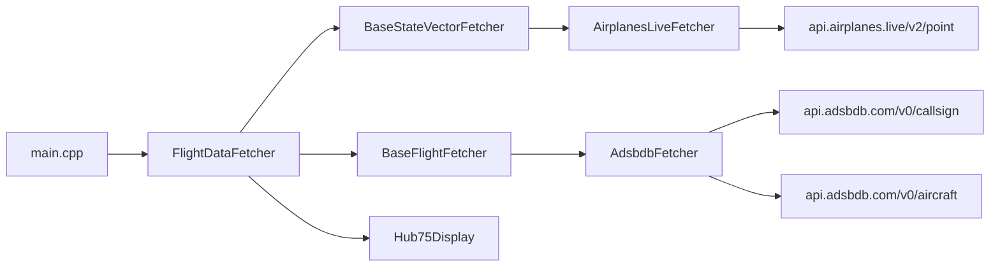

# Nimbus — Build Handoff (v3)

> **Running source of truth for Nimbus.** First light works. Remaining work is
> enrichment diagnostics, adaptive layout/simulation, flicker diagnosis and
> enclosure polish.

Cute DIY LED flight tracker. Single panel, near-zero soldering, free data, matte-black metal enclosure.

---

## Status at a glance

| Area | Status |
|---|---|
| Hardware wiring (panel, power, HUB75, MatrixPortal S3) | **DONE** |
| airplanes.live position/callsign/altitude data on panel | **VERIFIED** |
| adsbdb route/operator enrichment on panel | **PARTIAL / DIAGNOSE** |
| HUB75 display driver (Adafruit Protomatter) | **DONE** |
| Board target (`adafruit_matrixportal_esp32s3`) | **DONE** |
| Docs (root + firmware README) | **DONE** |
| Rebrand to Nimbus | **DONE** |
| Bundled color airline logos (500+ airlines) | **DONE** |
| Video-inspired color card + 3s cycling | **BUILT; ADAPTIVE LAYOUT TODO** |
| User WiFi / installation location | **DONE** |
| Firmware build + first USB upload | **DONE** |
| First-light panel bring-up | **PARTIAL SUCCESS** |
| Desktop 128×64 simulator / fixture tests | **TODO** |
| Flicker diagnosis | **TODO** |
| Enclosure CAD / fab | **TODO** — measure first |

---

## First-light findings — 10 July 2026

Photo evidence from the real 128×64 panel:

- **Panel/display path works:** full panel area is active, orientation is
  correct, all 64 rows render, text is legible, and there is no obvious
  half-height/doubled-image FM6124 failure.
- **airplanes.live works on-device:** the panel showed real state-vector data
  for `MLE227`, altitude `250FT`, and aircraft code `BC35`.
- **Route/operator enrichment was absent for that card:** airline name, logo,
  IATA route and airport context were blank.
- This does **not yet prove a general fetch/parser failure**. `MLE227` may not
  have an adsbdb route/operator match. The logo is indexed by airline IATA
  code, so it cannot appear when route enrichment supplies no operator IATA.
- **Layout currently wastes space for partial data:** it reserves the logo and
  rich-route regions even when those fields are absent.
- **Flicker observed:** cause is not confirmed. Distinguish camera rolling
  shutter from naked-eye flicker, then isolate panel power before changing
  Protomatter timing.

---

## Hardware status — DONE

All connections made and verified from photos:

- **Panel:** K580-32S-128×64-V2.3, P2.5-E tile. Driver chip confirmed **FM6124** (labelled "FM 6124EJ" on the panel ICs).
- **Power:** DC5525 (5.5×2.5mm female, confirmed correct for the JCY-0580 5V/8A brick) → forks (RED→+5V, BLACK→GND) → panel's 4-pin power header. Second 4-pin header left unconnected (parallel chaining tap, not needed for single panel).
- **Data:** panel HUB75 **INPUT** = header **J1** (silkscreened R1/G1/B1/R2/G2/B2/A/B/C/D/CK/LS/OE and "75E"). Ribbon seated both ends, OR board plugged directly onto J1.
- **Board:** MatrixPortal S3 (ESP32-S3), power LEDs confirmed lit over USB. Amber standoff stickers already absent.

Nothing left to wire.

### Still-live hardware reminders

- **Polarity:** RED→+5V, BLACK→GND at the DC5525. Backwards = dead panel.
- **USB test = LOW brightness only.** Bright images sparkle/ghost on USB; that's the power limit, not a fault. Full brightness needs the 8A brick.
- **IN vs OUT is harmless to get wrong** (blank image, no damage). If blank on power-up, reseat ribbon / confirm it's on J1.

---

## Firmware — current architecture (as built)

- **Project:** Nimbus — code under `firmware/`.
- **Board:** `adafruit_matrixportal_esp32s3` (`firmware/platformio.ini`).
- **Display:** `Hub75Display` via Adafruit Protomatter (128×64, MatrixPortal S3 pin preset).
- **Boot splash:** `Nimbus`
- **Data:** no accounts, no API keys, no payment cards.

### Adapters (live)

| Adapter | Role | Files |
|---|---|---|
| `AirplanesLiveFetcher` | Positions (≤1 req/sec, radius km→nm) | `firmware/adapters/AirplanesLiveFetcher.{h,cpp}` |
| `AdsbdbFetcher` | Route, airline + aircraft enrichment (404-safe) | `firmware/adapters/AdsbdbFetcher.{h,cpp}` |
| `Hub75Display` | HUB75 panel via Protomatter | `firmware/adapters/Hub75Display.{h,cpp}` |

`firmware/assets/AirlineLogoLibrary.*` provides 502 bundled 36×24 RGB565
logos indexed by airline IATA code. No logo API or CDN is used at runtime.

### Config headers that matter

| File | What to set |
|---|---|
| `firmware/config/WiFiSecrets.h` | Local gitignored hotspot SSID + password (**2.4GHz only**) |
| `firmware/config/UserConfiguration.h` | `CENTER_LAT` / `CENTER_LON` / `RADIUS_KM`, brightness, `MAX_TRACKED_FLIGHTS` |
| `firmware/config/HardwareConfiguration.h` | Panel size + MatrixPortal S3 pins (already set) |
| `firmware/config/TimingConfiguration.h` | `FETCH_INTERVAL_SECONDS=30`, `DISPLAY_CYCLE_SECONDS=3` |
| `firmware/config/APIConfiguration.h` | Base URLs only — no secrets |

### Data stack reference

- **Positions:** `GET https://api.airplanes.live/v2/point/{lat}/{lon}/{radius}` — 1 req/sec, radius in **nautical miles**, no key.
- **Route:** `GET https://api.adsbdb.com/v0/callsign/{callsign}` — no key.
- **Aircraft/display name:** `GET https://api.adsbdb.com/v0/aircraft/{hex}` — no key.
- **Airline logos:** bundled into the firmware from pinned, licensed sources.

---

## TODO — next actions

### 1. Config before first flash (blocking)

- [x] Set hotspot credentials in gitignored `WiFiSecrets.h`.
- [x] Confirm hotspot is **2.4GHz** (iPhone: Personal Hotspot → **Maximize Compatibility ON**).
- [x] Set the installation coordinates in `UserConfiguration.h`.
- [x] Keep `DISPLAY_BRIGHTNESS` low (~20–40 of 255) for USB bench test.

### 2. First-light bring-up

- [x] Plug MatrixPortal S3 → PC via USB-C.
- [x] Upload Nimbus successfully through the ESP32-S3 ROM bootloader.
- [x] Power panel and render a real nearby aircraft at low brightness.
- [x] Confirm full-height, correctly oriented 128×64 output.
- [ ] Confirm a known commercial flight renders airline, route and logo.
- [ ] Diagnose flicker (power vs camera artifact vs refresh timing).

### 3. Data/enrichment diagnostics

- [ ] Capture at least one full 30-second Serial Monitor cycle at 115200 baud.
- [ ] Log each adsbdb request URL/result clearly, including 200 vs 404 and
  parse failures (never credentials).
- [ ] Capture the ICAO24 hex and callsign for a sparse card such as `MLE227`.
- [ ] Replay the same `/callsign/{callsign}` and `/aircraft/{hex}` requests
  from the PC to distinguish unavailable data from firmware parsing/network
  faults.
- [ ] Test a known commercial London flight whose adsbdb response contains
  airline IATA, route and airport data; verify its bundled logo appears.
- [ ] Only change API/parser code if evidence shows valid fields are being
  dropped.

### 4. Desktop simulator and fixture coverage

- [ ] Build a native **128×64** card simulator that outputs a nearest-neighbour
  scaled PNG matching the panel pixel grid.
- [ ] Use the same layout constants and bundled RGB565 logo data as firmware
  where practical, so the simulator does not become a separate design.
- [ ] Add deterministic fixtures for:
  - complete commercial arrival into London;
  - complete commercial departure from London;
  - unknown-route GA/military flight;
  - known airline with missing logo;
  - long airline/airport/aircraft strings;
  - ground aircraft and missing altitude.
- [ ] Make fixture screenshots easy to compare before every panel upload.

### 5. Adaptive use of the full 128×64 display

- [ ] Keep the rich commercial card: color logo, airline, IATA route,
  aircraft, arrival/departure context, airport, callsign and altitude.
- [ ] Add a sparse-card layout that reclaims the logo/route area when
  enrichment is unavailable instead of leaving large blank regions.
- [ ] For sparse cards, prioritize larger callsign, altitude and aircraft type;
  consider distance/bearing and registration from airplanes.live.
- [ ] Do not invent airline/route data or perform extra fallback API calls.
- [ ] Confirm all variants remain legible at actual panel distance and low
  bench brightness.

### 6. Flicker diagnosis

- [ ] Confirm whether flicker is visible to the naked eye or only in phone
  video/photos.
- [ ] Test a static card with the panel on the regulated 5V/8A brick and the
  MatrixPortal on USB, with common ground and brightness `32`.
- [ ] Reseat power connectors and verify polarity before each test.
- [ ] If visible flicker remains on stable external power, test Protomatter
  bit depth/refresh settings one change at a time.
- [ ] Revisit FM6124-specific initialization only if visual artifacts—not just
  flicker—indicate a driver timing problem.

### 7. Enclosure (measure once, then CAD)

- [ ] Measure: (1) panel thickness, (2) back mounting holes pos+dia, (3) board depth off the back, (4) power+HUB75 connector positions, (5) cable exit point.
- Open-fronted shell; smoked acrylic → panel → board+wiring → back panel w/ cable notch.
- Window ~320×160mm, depth ~40–50mm. Acrylic: *"smoked grey tinted acrylic cut to size 3mm"*, held captive, no glue.
- UK fab options: Fractory, Andover Laser, Unicorn Sheet Metal, Lasered, LaserMaster.

---

## Human flash checklist

1. Plug board → Windows PC via **USB-C**.
2. Open **Cursor**, PlatformIO extension installed.
3. Open the **`firmware`** folder.
4. Fill in **hotspot WiFi** + **location** + **low brightness**.
5. Hotspot on **2.4GHz**.
6. PlatformIO **Upload (→)**.
7. Read panel (see first-light troubleshooting above).

---

## Key gotchas

- **Polarity** RED→+5V / BLACK→GND at DC5525 — the one damaging mistake.
- **airplanes.live:** 1 req/sec, radius in **nautical miles** (km→nm is internal in `AirplanesLiveFetcher`).
- **Hotspot must be 2.4GHz** — ESP32-S3 can't see 5GHz.
- **Trim callsign** (trailing spaces) before adsbdb — already done in the fetcher.
- **USB test = low brightness**; full brightness needs the 8A brick.
- **128×64** is the board's practical max resolution for this setup.
- **FM6124** may need a manual init if the first image is garbled/doubled.

---

## Completed work — Free-API + HUB75 Display Swap

> Historical notes for Nimbus. Implemented in the current tree.

### Context (pre-swap)

`FlightDataFetcher` already sat behind `BaseStateVectorFetcher` and `BaseFlightFetcher`, so new adapters could drop in cleanly.

Earlier stack used account-gated position/route APIs and a WS2812 NeoMatrix driver on a generic ESP32 board. Real hardware is a **HUB75** 128×64 FM6124 panel on **MatrixPortal S3** — different protocol and board. That required a driver replacement, not a config tweak.

Constraint: **no payment card anywhere**, even if expected charge is £0.

### Verified API shapes

- `GET https://api.airplanes.live/v2/point/{lat}/{lon}/{radius_nm}` → `{ "ac":[{hex, flight, lat, lon, alt_baro, gs, track, t, r, category, seen_pos, dst, dir, ...}], "msg", "now", "total" }`. Bonus: `dst` (nm) and `dir` (bearing) — no hand-rolled haversine for this source.
- `GET https://api.adsbdb.com/v0/callsign/{callsign}` → `response.flightroute` with airline + origin/destination. **404** when unknown.
- `GET https://api.adsbdb.com/v0/aircraft/{hex}` → `response.aircraft` with type/registration/owner. Route and aircraft are **two separate calls** → `fetchFlightInfo(callsign, icao24Hex, outInfo)`.

### Board / library choice

- PlatformIO board: `adafruit_matrixportal_esp32s3`.
- Display lib: **Adafruit Protomatter** (official MatrixPortal S3 pin preset; works with WiFi).
- Avoided **ESP32-HUB75-MatrixPanel-DMA** — its README warns MatrixPortal S3 + WiFi does not work well.

MatrixPortal S3 Protomatter pins (in `HardwareConfiguration.h`):

- `rgbPins = {42,41,40,38,39,37}`
- `addrPins = {45,36,48,35,21}` (5 addr → 64-row)
- `clock=2`, `latch=47`, `oe=14`

### A. Data source swap — DONE

- [x] Extend `BaseFlightFetcher::fetchFlightInfo(flightIdent, icao24Hex, outInfo)`.
- [x] Add `AirplanesLiveFetcher` — km→nm, trim callsign, skip `~` hex / stale `seen_pos`, map `dst`/`dir`, self-throttle ≥1000ms.
- [x] Add `AdsbdbFetcher` — callsign + aircraft calls, 404-safe, human-readable aircraft `type`.
- [x] `FlightDataFetcher` — pass hex, sort by `distance_km`, cap at `MAX_TRACKED_FLIGHTS` (default 5).
- [x] `APIConfiguration.h` — airplanes.live + adsbdb base URLs; no secrets.
- [x] `main.cpp` wires `AirplanesLiveFetcher` + `AdsbdbFetcher`.

### B. Display driver swap — DONE

- [x] `platformio.ini` → `adafruit_matrixportal_esp32s3`, Protomatter, `ARDUINO_USB_CDC_ON_BOOT=1`.
- [x] `HardwareConfiguration.h` → 128×64 HUB75 + MatrixPortal pins.
- [x] Add `Hub75Display` (GFX card drawing; `color565` / `show`).
- [x] `main.cpp` uses `Hub75Display`; boot splash shows **Nimbus**.

### C. Config, docs & rebrand — DONE

- [x] `UserConfiguration.h` — lat/lon/`RADIUS_KM` + `MAX_TRACKED_FLIGHTS`.
- [x] Root + `firmware/README.md` branded as Nimbus.
- [x] Removed stock brackets / marketing images; kept Apache-2.0 LICENSE.

### D. Color logo card — DONE

- [x] Bundle 502 optimized 36×24 RGB565 airline logos; no runtime logo CDN.
- [x] Prefer curated icon artwork where available.
- [x] Parse IATA airport codes, names, municipalities and coordinates.
- [x] Show logo, airline, IATA route, aircraft, arrival/departure context,
  airport name, callsign and altitude.
- [x] Rotate cached flight cards every 3 seconds between 30-second data polls.

### Acceptance criteria — met in code; hardware enrichment still pending

| Criterion | How |
|---|---|
| Builds with no account-gated API creds | Free adapters + config only |
| Polls airplanes.live ≤1 req/sec | 30s cycle + defensive throttle |
| Position data path to panel | **Verified**: callsign, altitude and type shown |
| Route/operator/logo path to panel | **Pending**: needs known commercial fixture |
| Unknown callsign/route doesn't crash | Per-call 404 handling; partial cards |
| No secrets / keys / cards | No credential constants remain |

### Known follow-ups (still open)

- Determine whether observed flicker is power-related, camera-only or refresh-related.
- Verify adsbdb enrichment and bundled logo rendering with a known commercial flight.
- Implement simulator-backed adaptive rich/partial layouts before aesthetic tuning.
